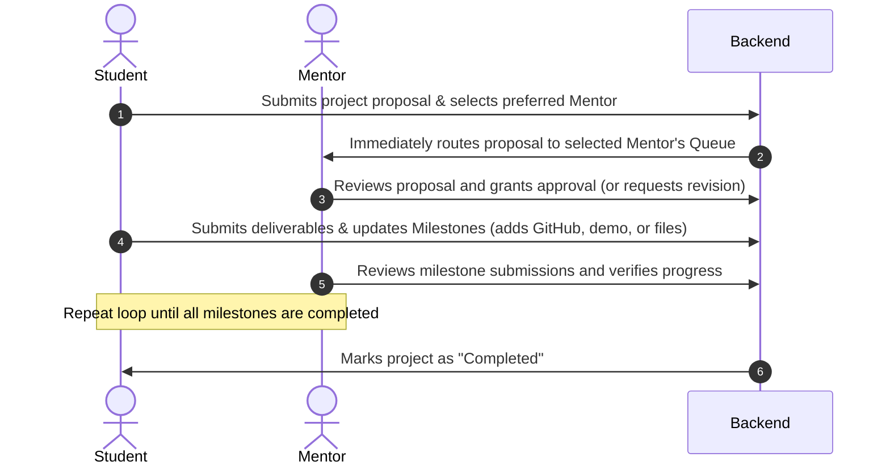

# CollabPM: Student Project Management Portal

CollabPM is a simple and clean academic portal that helps students, mentors, and administrators collaborate on university projects. 

Students can submit their project ideas, select a faculty mentor, and track their progress through milestone phases. Mentors can review proposals, leave feedback, and approve milestones.

---

## How It Works (Workflow)
### The Project Lifecycle

The project follows a direct and easy-to-follow process:

1. **Submit**: A student submits their project details, links their GitHub/Demo, and selects a preferred faculty mentor.
2. **Review**: The selected mentor immediately sees the proposal in their dashboard, reviews the details, and approves it or asks for changes.
3. **Build**: Once approved, the student works on project milestones (like design, development, and testing) and submits progress.
4. **Complete**: The mentor inspects the milestone submissions, signs off on each phase, and marks the project as completed.

---

## Core Features by Role

### 🎓 1. For Students
* **Project Submission**: Submit your project title, description, team members, and select a mentor.
* **Milestone Roadmap**: Check off phases (Proposal, Design, Development, Testing) as you complete them.
* **Deliverables**: Link your GitHub repositories, live demo URLs, and upload documents/files.

### 🧑‍🏫 2. For Mentors
* **Student Proposals Queue**: View all projects where students have selected you as their mentor.
* **Progress Verification**: Review and sign off on submitted student milestones.
* **Feedback & Grading**: Write review comments and approve or request revisions.

### 🔑 3. For Administrators
* **Project Registry**: Oversee all projects in the system, adjust status, or reassign mentors if needed.
* **User Management**: View all profiles and elevate students to mentor roles.
* **Help Desk**: View and resolve student support questions.

---

## Technology Stack

* **Frontend**: React 19, TypeScript, Tailwind CSS (for styling), and Motion (for smooth animations).
* **Backend**: Node.js & Express (handles API requests and routes files safely).
* **Database**: Supabase (manages user accounts, project data, and file uploads).
* **Demo Mode**: The application has an offline demo option. If a database is not connected, you can still test all dashboards instantly using pre-configured test profiles.

---

## How to Run Locally

### Prerequisites
* **Node.js** installed on your computer.

### Steps to Run

1. **Install Dependencies**:
   ```bash
   npm install
   ```

2. **Configure Database (Optional)**:
   Create a file named `.env` in the root folder and add your Supabase credentials (see `.env.example` as a template):
   ```env
   VITE_SUPABASE_URL=https://your-project.supabase.co
   VITE_SUPABASE_ANON_KEY=your-anon-key
   ```
   *If you do not set up database keys, the app will run in **Demo Mode**, letting you log in instantly with test profiles.*

3. **Start the App**:
   ```bash
   npm run dev
   ```
   Open your browser and navigate to `http://localhost:3000`.

---

## Database Setup (For Supabase)

If you are connecting a live database, run this script in your Supabase SQL Editor to create the tables:

```sql
-- Create User Profiles
CREATE TABLE IF NOT EXISTS public.profiles (
  uid TEXT PRIMARY KEY,
  email TEXT NOT NULL,
  display_name TEXT NOT NULL,
  photo_url TEXT,
  role TEXT NOT NULL DEFAULT 'student',
  department TEXT,
  student_id TEXT,
  mentor_id TEXT,
  created_at TIMESTAMPTZ DEFAULT now()
);

-- Create Projects Table
CREATE TABLE IF NOT EXISTS public.projects (
  id TEXT PRIMARY KEY DEFAULT gen_random_uuid()::text,
  title TEXT NOT NULL,
  description TEXT NOT NULL,
  category TEXT NOT NULL,
  team_members TEXT NOT NULL,
  student_id TEXT NOT NULL,
  student_name TEXT NOT NULL,
  student_email TEXT NOT NULL,
  mentor_id TEXT NOT NULL,
  mentor_name TEXT NOT NULL,
  status TEXT NOT NULL DEFAULT 'pending',
  created_at TIMESTAMPTZ DEFAULT now(),
  github_url TEXT,
  demo_url TEXT,
  attachment_url TEXT,
  attachment_name TEXT,
  milestones JSONB NOT NULL DEFAULT '[]'::jsonb,
  feedback JSONB NOT NULL DEFAULT '[]'::jsonb
);

-- Create Support Tickets Table
CREATE TABLE IF NOT EXISTS public.support_queries (
  id TEXT PRIMARY KEY DEFAULT gen_random_uuid()::text,
  name TEXT NOT NULL,
  email TEXT NOT NULL,
  subject TEXT NOT NULL,
  message TEXT NOT NULL,
  status TEXT NOT NULL DEFAULT 'open',
  created_at TIMESTAMPTZ DEFAULT now()
);
```
