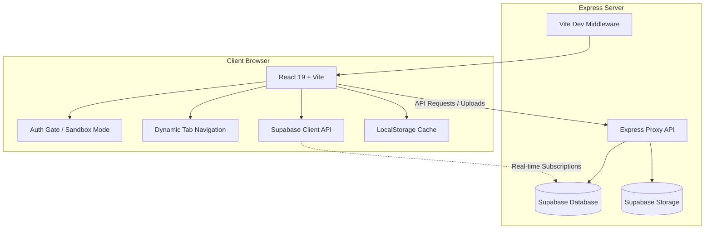
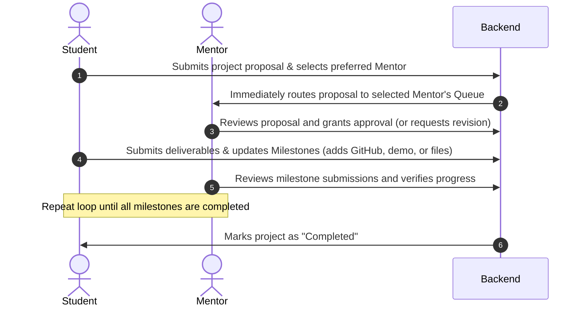

<div align="center">
  
</div>

# CollabPM: Student Project Management Portal

CollabPM is a professional, high-fidelity academic project management portal designed to streamline collaboration between students, mentors, and administrators. The platform supports project submission, milestone tracking, real-time feedback, support queries, and full administrative oversight.

---

## Architecture Overview

CollabPM is built with a decoupled but highly integrated React-Express architecture. It leverages Supabase for authentication, real-time database management, and object storage.



- **Frontend**: Single Page Application (SPA) powered by React 19, TypeScript, and Vite. UI styling is managed with Tailwind CSS (v4), featuring fluid animations driven by Motion and clean typography using Lucide Icons.
- **Backend**: Express server (`server.ts`) that serves as a reverse proxy for Supabase operations, bypassing CORS limits, enforcing database safety rules, and providing sandbox fallbacks. In production, the server is bundled into a single file via `esbuild`.
- **Database & Storage**: Powered by Supabase PostgreSQL and Supabase Storage buckets. If Supabase credentials are not configured, the application automatically activates **Sandbox Mode**, utilizing `localStorage` to cache state and simulate workflows across roles.

---

## Core Features by Role

CollabPM provides tailored dashboards and tools for three primary user roles:

### 🎓 1. Student Dashboard
- **Project Submission**: Submit project proposals detailing description, category, team members, and select their preferred mentor.
- **Interactive Milestone Roadmap**: Track progress across preset milestones (e.g., Proposal, UI Design, Core Dev, Testing) or custom steps.
- **Resource Linking**: Submit project deliverables by linking GitHub repositories, live demo URLs, and uploading files.
- **Attachment Uploads**: Seamlessly upload project files via base64 encoding processed securely by the Express backend.

### 🧑‍🏫 2. Mentor Panel
- **Assigned Projects Overview**: View and manage all projects where they have been selected as the mentor.
- **Milestone Verification**: Review and approve student milestone submissions.
- **Structured Feedback**: Write comments and assign official project statuses (`approved`, `revision`, `rejected`).

### 🔑 3. Administrative Console
- **Project Catalog & Oversight**: Oversee all submissions, approve/reject projects, and confirm or adjust mentor selections.
- **User Directory**: View all registered user profiles, change department affiliations, and elevate student accounts to mentors.
- **Helpdesk & Support**: Manage, review, and resolve user-submitted support queries.

---

## Technology Stack

### Frontend
- **React 19** & **TypeScript**
- **Vite 6** (Development Server & Bundler)
- **Tailwind CSS v4** (Utility Styles)
- **Motion** (Fluid transition and state animations)
- **Lucide React** (Vector icons)

### Backend
- **Express** (REST API endpoints & Static assets hosting)
- **TSX** / **ESBuild** (TypeScript execution and production compilation)
- **Dotenv** (Environment variable management)

### Database & Auth
- **Supabase JS Client** (Auth, PostgreSQL Database, and Storage)
- **HTML5 Web Storage** (Session state caching and offline Sandbox fallback)

---

## System Workflows

### 1. The Project Lifecycle


### 2. Database Synchronization & Resiliency
CollabPM uses a hybrid approach to maintain state consistency:
1. **Supabase Realtime Channel**: Subscribes directly to postgres changes to instantly update the UI when records change.
2. **High-Frequency Polling**: A fallback 4-second polling timer triggers updates in environments where WebSocket connections are blocked or when running in Sandbox Mode.
3. **Local Cache Engine**: Keeps an encrypted mirror of project states in `localStorage`, guaranteeing offline readability and instant rendering on boot.

---

## Database Provisioning (Supabase Setup)

To configure the live database environment, execute the following SQL script in your Supabase SQL Editor:

```sql
-- 1. Create Profile / Users Table
CREATE TABLE IF NOT EXISTS public.profiles (
  uid TEXT PRIMARY KEY,
  email TEXT NOT NULL,
  display_name TEXT NOT NULL,
  photo_url TEXT,
  role TEXT NOT NULL DEFAULT 'student' CHECK (role IN ('student', 'mentor', 'admin')),
  department TEXT,
  student_id TEXT,
  mentor_id TEXT,
  created_at TIMESTAMPTZ DEFAULT timezone('utc'::text, now())
);

ALTER TABLE public.profiles ENABLE ROW LEVEL SECURITY;
CREATE POLICY "Allow public read on profiles" ON public.profiles FOR SELECT USING (true);
CREATE POLICY "Allow user all access on own profile" ON public.profiles FOR ALL USING (true) WITH CHECK (true);

-- 2. Create Projects Submissions Table
CREATE TABLE IF NOT EXISTS public.projects (
  id TEXT PRIMARY KEY DEFAULT gen_random_uuid()::text,
  title TEXT NOT NULL,
  description TEXT NOT NULL,
  category TEXT NOT NULL,
  team_members TEXT NOT NULL,
  student_id TEXT NOT NULL,
  student_name TEXT NOT NULL,
  student_email TEXT NOT NULL,
  mentor_id TEXT NOT NULL,
  mentor_name TEXT NOT NULL,
  status TEXT NOT NULL DEFAULT 'pending' CHECK (status IN ('pending', 'approved', 'rejected', 'revision', 'completed')),
  created_at TIMESTAMPTZ DEFAULT timezone('utc'::text, now()),
  github_url TEXT,
  demo_url TEXT,
  attachment_url TEXT,
  attachment_name TEXT,
  milestones JSONB NOT NULL DEFAULT '[]'::jsonb,
  feedback JSONB NOT NULL DEFAULT '[]'::jsonb
);

ALTER TABLE public.projects ENABLE ROW LEVEL SECURITY;
CREATE POLICY "Allow public read on projects" ON public.projects FOR SELECT USING (true);
CREATE POLICY "Allow anyone to create projects" ON public.projects FOR INSERT WITH CHECK (true);
CREATE POLICY "Allow student/mentor updates on relevant projects" ON public.projects FOR UPDATE USING (true) WITH CHECK (true);

-- 3. Create Support Queries Table
CREATE TABLE IF NOT EXISTS public.support_queries (
  id TEXT PRIMARY KEY DEFAULT gen_random_uuid()::text,
  name TEXT NOT NULL,
  email TEXT NOT NULL,
  subject TEXT NOT NULL,
  message TEXT NOT NULL,
  status TEXT NOT NULL DEFAULT 'open' CHECK (status IN ('open', 'resolved')),
  created_at TIMESTAMPTZ DEFAULT timezone('utc'::text, now())
);

ALTER TABLE public.support_queries ENABLE ROW LEVEL SECURITY;
CREATE POLICY "Allow anyone to insert support queries" ON public.support_queries FOR INSERT WITH CHECK (true);
CREATE POLICY "Allow user select on support queries" ON public.support_queries FOR SELECT USING (true);
```

---

## How to Run Locally

### Prerequisites
- **Node.js** (v18 or higher)
- **NPM**

### Setup Instructions

1. **Install Dependencies**:
   ```bash
   npm install
   ```

2. **Configure Environment Variables**:
   Create a `.env` file in the root directory and specify your Supabase keys (see `.env.example` as a template):
   ```env
   VITE_SUPABASE_URL=https://your-project-id.supabase.co
   VITE_SUPABASE_ANON_KEY=your-anon-key
   SUPABASE_SERVICE_ROLE_KEY=your-service-role-key
   ```
   *Note: If no `.env` file is present, the app starts in **Sandbox Mode** using simulated profiles.*

3. **Start the Development Server**:
   ```bash
   npm run dev
   ```
   This command boots up the Express server on port `3000` with hot-reloading. Open `http://localhost:3000` in your web browser.

4. **Build and Run for Production**:
   ```bash
   npm run build
   npm start
   ```
